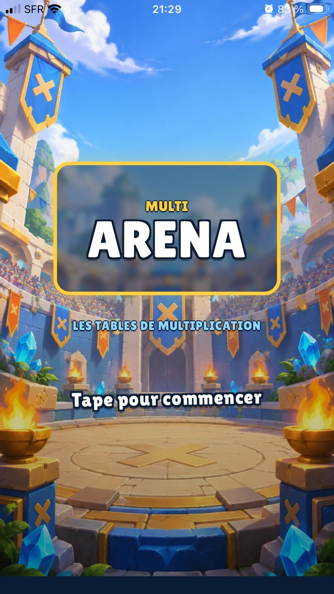
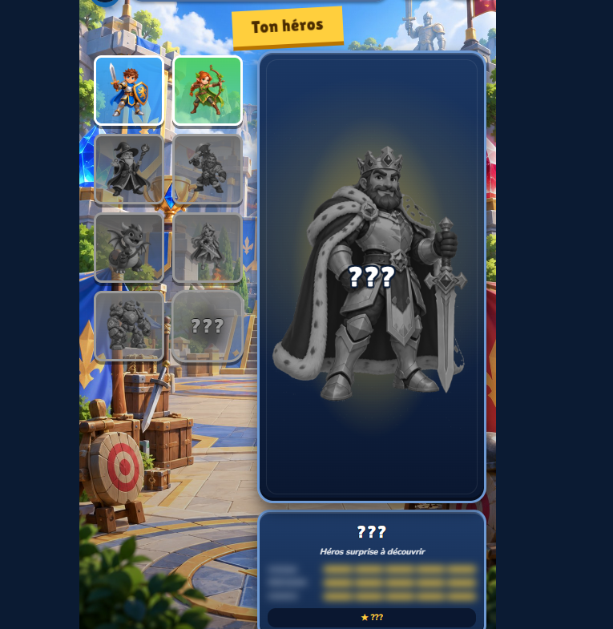

# Multi X Arena

### Les tables de multiplication deviennent un jeu d'arène

[](https://engob.github.io/MultixArena/)


Multi X Arena est un jeu éducatif en français, pensé pour apprendre les tables sans avoir l'impression de réciter une leçon. Il combine aventure solo, progression mémorielle, héros à pouvoirs et vrais duels locaux sur le même écran.



## Une aventure qui s'adapte au joueur

| Menu principal | Choix du héros |
|---|---|
|  |  |

- **24 niveaux** répartis dans six mondes, avec un gardien à la fin de chacun.
- **Quatre rythmes** : Réflexion, Entraînement, Réflexe et un rythme surprise.
- **Dix héros**, chacun avec un avantage réellement actif en partie.
- **Modes solo** : Sprint, Chasse aux pièges, Miroir, Mort subite, Ascension, Fantôme et Les jumeaux.
- **Modes à deux** : Bataille et Bats le boss !, jouables face à face sur le même appareil.
- **Progression locale et hors ligne**, exportable depuis les Options.

## Ce que change la 4.6.9

- **Bataille** et **Bats le boss !** passent désormais le décompte sans écran bleu ;
- le curseur **Effets et clics UI** réagit en continu sur mobile et son réglage reste mémorisé ;
- les clics de navigation sont moins agressifs, y compris au volume maximal ;
- la vignette de la **Princesse** utilise son portrait carré sans zoom ni décalage forcé ;
- le vérificateur de livraison bloque le retour des deux erreurs de décompte.

## Héros secrets

Les deux nouveaux héros sont volontairement difficiles à obtenir :

- **Chronomancienne** : 72 étoiles, les 6 mondes terminés, 48 tables automatiques sur plusieurs jours, une série de 10 jours et 260 rubis.
- **Alchimiste** : 72 étoiles, les 6 mondes terminés, 55 tables automatiques, un meilleur combo de 20 et 300 rubis.

Leurs pouvoirs retirent respectivement une ou deux mauvaises réponses lorsque la moitié du temps d'une question est écoulée.

## Installer la PWA

- **iPhone/iPad** : ouvrir le jeu dans Safari → Partager → **Sur l'écran d'accueil**.
- **Android/Chrome** : menu du navigateur → **Installer l'application**.
- **Ordinateur** : ouvrir directement le lien GitHub Pages.

La mise à jour conserve la sauvegarde locale et n'interrompt plus une partie en cours. Avant de désinstaller la PWA ou d'effacer les données du navigateur, utiliser **Options → Télécharger** pour sauvegarder la progression.

## Publication GitHub Pages

Le dépôt contient la version compilée prête à servir. Déposer tout son contenu à la racine de `main`, puis configurer :

1. **Settings → Pages** ;
2. **Deploy from a branch** ;
3. branche `main`, dossier `/ (root)`.

Ne pas pousser à la place un `index.html` source qui référence `/src/main.tsx` : GitHub Pages ne compile pas TypeScript.

## Atelier

L'Atelier est volontairement séparé du jeu :

```text
https://engob.github.io/MultixArena/atelier.html
```

Il permet de régler l'habillage, les images, les sons, les couleurs et les modes. Les réglages restent locaux jusqu'à publication du `pack.json` ou des fichiers concernés sur GitHub.

## Vérifier une livraison

```bash
node scripts/verify-release.mjs
```

Le script contrôle la cohérence de version, le bundle, le service worker, l'orientation et tous les assets actifs.

## Documentation

- [Diagnostic technique 4.6.9](docs/DIAGNOSTIC_TECHNIQUE.md)
- [Idées d'amélioration classées](docs/IDEES_AMELIORATION.md)

## Confidentialité

Aucun compte, aucune publicité et aucun suivi. La progression reste dans le navigateur de l'appareil tant que l'utilisateur ne l'exporte pas lui-même.
