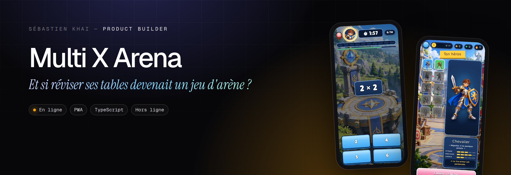
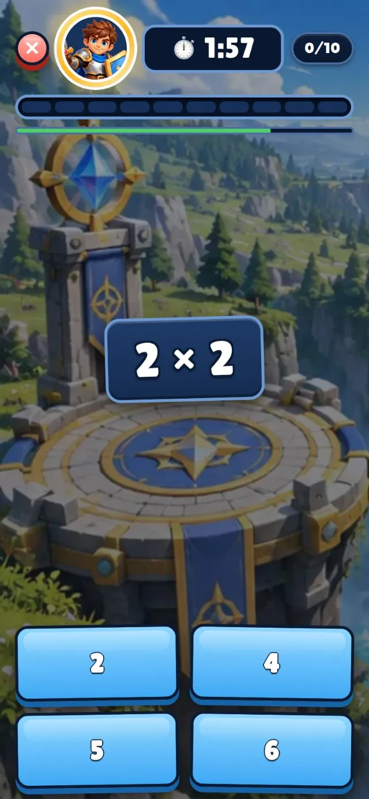
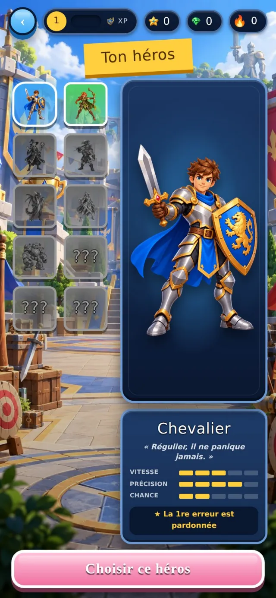
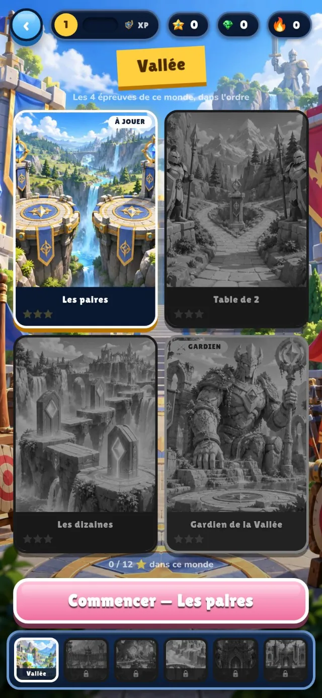
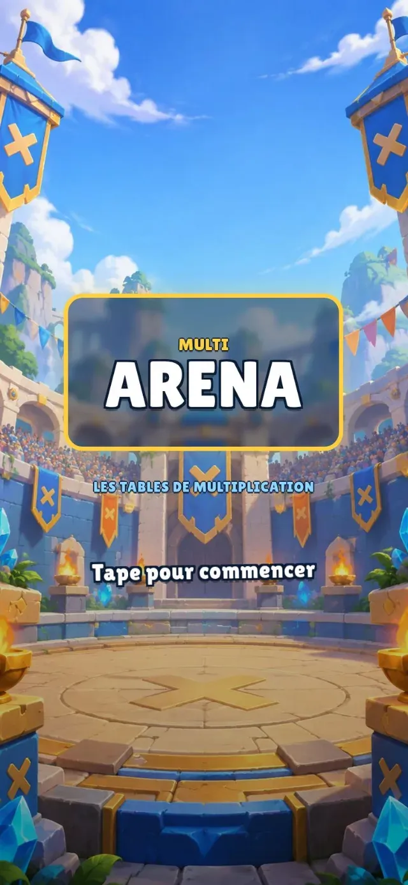

<p align="center"><a href="https://engob.github.io/MultixArena/"></a></p>

<p align="center">
  <a href="https://engob.github.io/MultixArena/"></a>
  <a href="https://www.senshicore.com/projets/multix-arena/"></a>
</p>

<h1 align="center">Multi X Arena</h1>
<p align="center"><b>Et si réviser ses tables devenait un jeu d'arène ?</b><br>Un jeu pour enfants qui transforme les tables de multiplication en aventure : des héros à pouvoirs, des mondes à conquérir, des duels à deux sur le même écran.</p>
<p align="center"><sub>Statut : <b>En ligne</b></sub></p>

> **Pensé pour le téléphone.** C'est une application web installable (PWA) : ouvrez la démo sur votre mobile pour la voir telle qu'elle a été conçue. Sur un ordinateur, l'affichage n'est pas celui prévu ; la [fiche du portfolio](https://www.senshicore.com/projets/multix-arena/) l'ouvre dans un cadre de téléphone, avec un QR code pour passer sur mobile.

---

### Le problème

Réciter ses tables lasse vite. Et beaucoup d'applications éducatives sont remplies de publicités ou demandent de créer un compte.

### L'idée

Emprunter les codes des jeux que les enfants aiment déjà — progression, héros, récompenses — et les mettre au service de la mémorisation.

### Comment c'est fait

Application web installable qui fonctionne hors ligne, sans compte, sans publicité ni suivi. Un « atelier » séparé permet de changer l'habillage, les sons et les modes de jeu sans toucher au code.

**Outils** &nbsp; `PWA` `TypeScript` `Hors ligne`

### Aperçu

<p align="center">   </p>

### Mentions

Aucune donnée collectée : pas de compte, pas de publicité, pas de suivi. Tout reste sur l'appareil.

### English

**Multi X Arena** — *What if practising times tables felt like an arena game?* A kids' game that turns times tables into an adventure: heroes with powers, worlds to conquer, two-player duels on the same screen.

Reciting times tables gets boring fast. And many learning apps are full of ads or require an account. Borrow the codes of games kids already love — progression, heroes, rewards — and put them to work for memorisation. An installable web app that works offline, with no account, ads or tracking. A separate “workshop” lets me change the look, sounds and game modes without touching the code.

---

<p align="center"><sub>Conçu, développé et mis en ligne par <b>Senshi Kabai</b>, Product Builder · <a href="https://www.senshicore.com/">portfolio</a> · <a href="https://www.senshicore.com/projets/multix-arena/">fiche du projet</a><br>© 2026 Senshi Kabai — tous droits réservés.</sub></p>


<details>
<summary><b>Documentation technique</b> · notes de développement et de mise en ligne</summary>

## Multi X Arena

#### Les tables de multiplication deviennent un jeu d'arène

[](https://engob.github.io/MultixArena/)


Multi X Arena est un jeu éducatif en français, pensé pour apprendre les tables sans avoir l'impression de réciter une leçon. Il combine aventure solo, progression mémorielle, héros à pouvoirs et vrais duels locaux sur le même écran.


### Une aventure qui s'adapte au joueur

| Menu principal | Choix du héros |
|---|---|
|  |  |

- **24 niveaux** répartis dans six mondes, avec un gardien à la fin de chacun.
- **Quatre rythmes** : Réflexion, Entraînement, Réflexe et un rythme surprise.
- **Dix héros**, chacun avec un avantage réellement actif en partie.
- **Modes solo** : Sprint, Chasse aux pièges, Miroir, Mort subite, Ascension, Fantôme et Les jumeaux.
- **Modes à deux** : Bataille et Bats le boss !, jouables face à face sur le même appareil.
- **Progression locale et hors ligne**, exportable depuis les Options.

### Ce que change la 4.6.13

- la grille de sélection utilise de nouveau les avatars carrés en pied : chaque héros y est visible entièrement, sans zoom ni recadrage ;
- les clics sur un élément verrouillé affichent toujours leur explication, mais ne jouent plus le son d'erreur ;
- aucun autre comportement du jeu n'est modifié.

### Héros secrets

Les deux nouveaux héros sont volontairement difficiles à obtenir :

- **Chronomancienne** : 72 étoiles, les 6 mondes terminés, 48 tables automatiques sur plusieurs jours, une série de 10 jours et 260 rubis.
- **Alchimiste** : 72 étoiles, les 6 mondes terminés, 55 tables automatiques, un meilleur combo de 20 et 300 rubis.

Leurs pouvoirs retirent respectivement une ou deux mauvaises réponses lorsque la moitié du temps d'une question est écoulée.

### Installer la PWA

- **iPhone/iPad** : ouvrir le jeu dans Safari → Partager → **Sur l'écran d'accueil**.
- **Android/Chrome** : menu du navigateur → **Installer l'application**.
- **Ordinateur** : ouvrir directement le lien GitHub Pages.

La mise à jour conserve la sauvegarde locale et n'interrompt plus une partie en cours. Avant de désinstaller la PWA ou d'effacer les données du navigateur, utiliser **Options → Télécharger** pour sauvegarder la progression.

### Publication GitHub Pages

Le dépôt contient la version compilée prête à servir. Déposer tout son contenu à la racine de `main`, puis configurer :

1. **Settings → Pages** ;
2. **Deploy from a branch** ;
3. branche `main`, dossier `/ (root)`.

Ne pas pousser à la place un `index.html` source qui référence `/src/main.tsx` : GitHub Pages ne compile pas TypeScript.

### Atelier

L'Atelier est volontairement séparé du jeu :

```text
https://engob.github.io/MultixArena/atelier.html
```

Il permet de régler l'habillage, les images, les sons, les couleurs et les modes. Les réglages restent locaux jusqu'à publication du `pack.json` ou des fichiers concernés sur GitHub.

### Vérifier une livraison

```bash
node scripts/verify-release.mjs
```

Le script contrôle la cohérence de version, le bundle, le service worker, l'orientation et tous les assets actifs.

### Documentation

- [Diagnostic technique 4.6.13](docs/DIAGNOSTIC_TECHNIQUE.md)
- [Idées d'amélioration classées](docs/IDEES_AMELIORATION.md)

### Confidentialité

Aucun compte, aucune publicité et aucun suivi. La progression reste dans le navigateur de l'appareil tant que l'utilisateur ne l'exporte pas lui-même.

</details>
